# Books and Scrolls

Books and scrolls is a website for avid readers who want a suggestion for a new book/series to read, with affliate links directly to a place to buy the books and also be able to suggest books to other people when they make an account. 

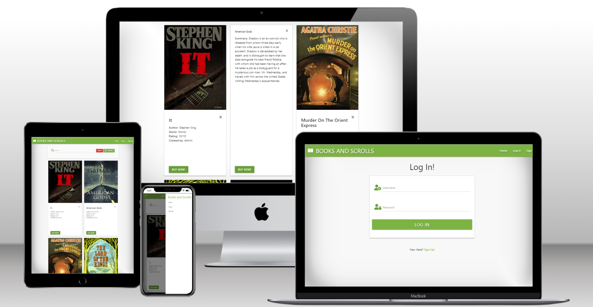

## User Stories 
|Story No.|Story|
| ------------- | ------------- |
|1| As the owner of the site, <br> I want people to be able to find books that interest them and have an affiliate link to purchase it <br> So people can find new books to read, and i can earn some money off of the service <br><br> I know I am done when I have book reviews that have relevent links to purchase attatched to them. |
|2|As a first time user, <br> I want to be able to easily see some book recommendations and reviews <br> So I can start a new series or novel and find a place to buy it <br><br> I know I am done when I have a list of novels/series that are easily viewed and have all the info needed at a quick glance. |
|3|As a repeat user, <br> I want to be able to add my own recommendations for books that I have read and enjoyed <br> So I can introduce as many other people to great books as I can <br><br> I know I am done when I can create and account, add book reviews, and edit my own reviews with an easy to use form that helps me input all the needed information.|
|4|As the owner of the site, <br> I want to have all reviews editable by me or the creater of the review <br> so I can make necessery changes to any reviews, and that no one else can change other peoples reviews <br> <br> I know I am done when only the logged in user or the admin can edit and make changes to the reviews. |
|5|As a current user, <br> To be able to check my profile, which shows me all my reviews, allows me to edit and delete them, as well as edit my password. <br> So I can keep track quickly of all my own reviews, and change my password if my passwords get comprimised. <br> <br> I know I am done when users have a profile page which links to all their own reviews, has all the profile information and has an option to edit password. |

***

## Wireframes
Below are the designs that I can use to build the site. I have used the user story numbers to link where I can meet the goal in my design. This will help me to think about the users needs as I build the page.

### Home Page Design<br>
User Story Number - 1, 2 <br>
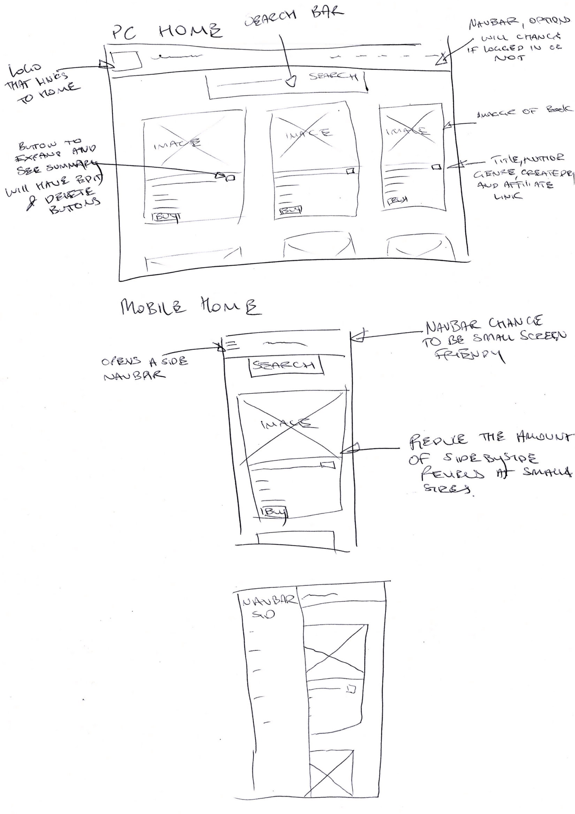

### Sign up Page Design<br>
User Story Number - 3 <br>
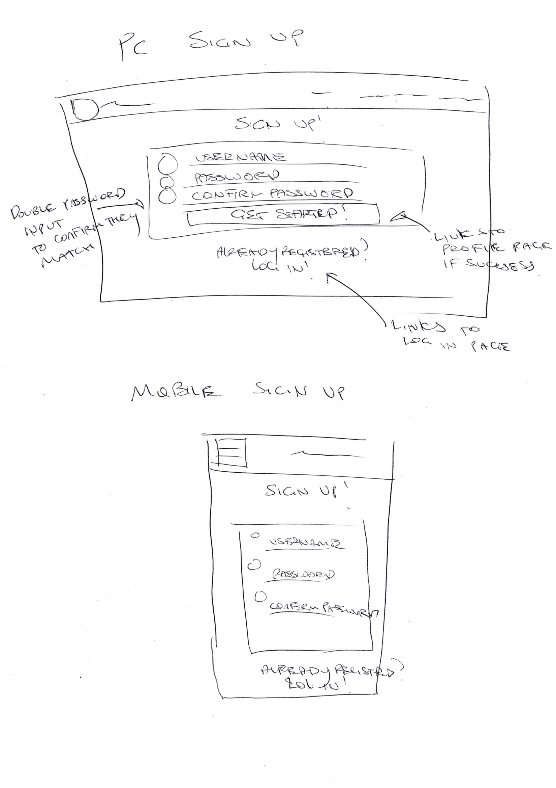

### Log In Page Design<br>
User Story Number - 3 <br>
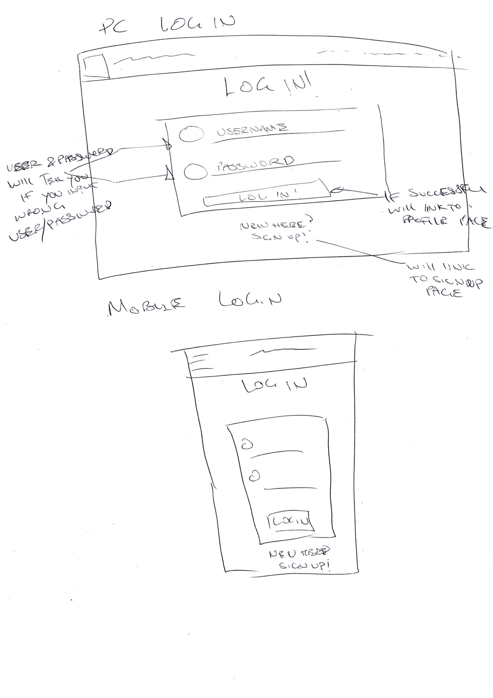

### Add/edit Review Page Design<br>
User Story Number - 4 <br>
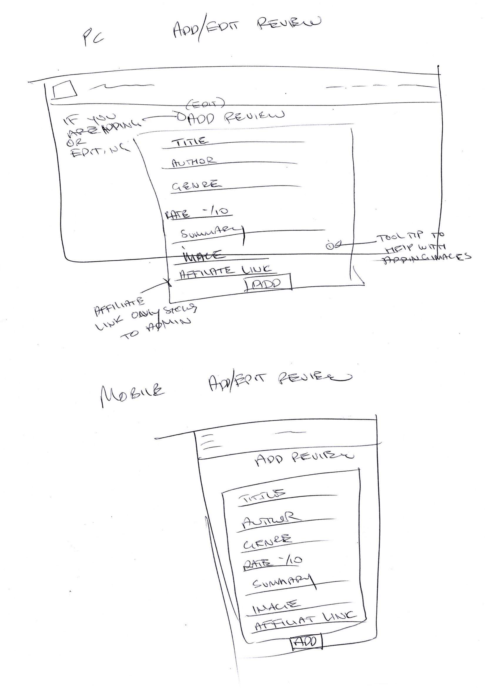

### Profile Page Design<br>
User Story Number - 5 <br>
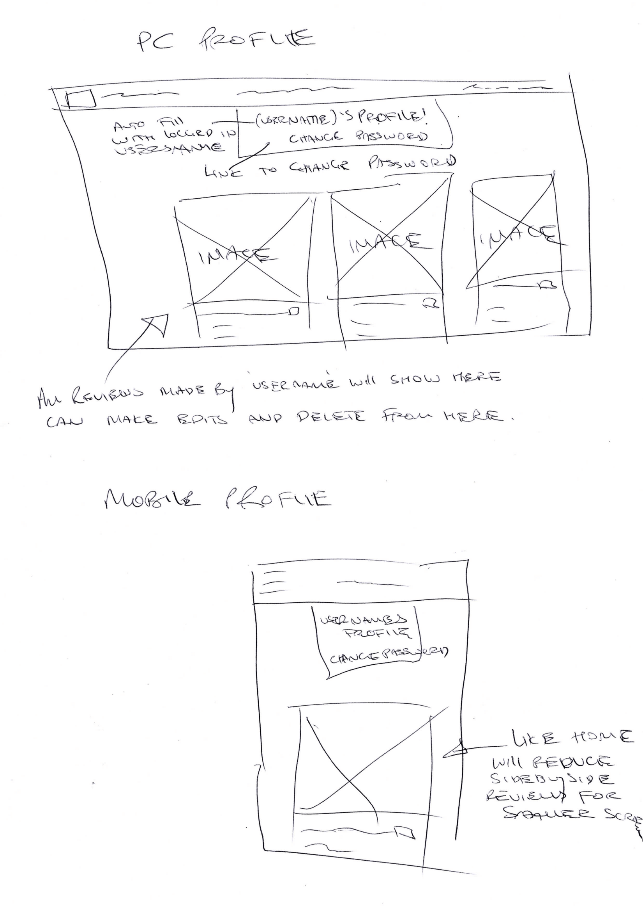

### Change Password Page Design<br>
User Story Number - 5 <br>


***

## Features

### Existing Features

- __Navigation Bar__

  - A navbar that will link to all pages, and will show relevent options based on weather you are logged in or not.
  - A mobile friendly alternative at smaller screen sizes.


- __Home page__

  - Will have access to all current reviews on the website for anyone, weather you are logged in or not.
  - Can only edit/delete reviews as admin or the creator of the review.

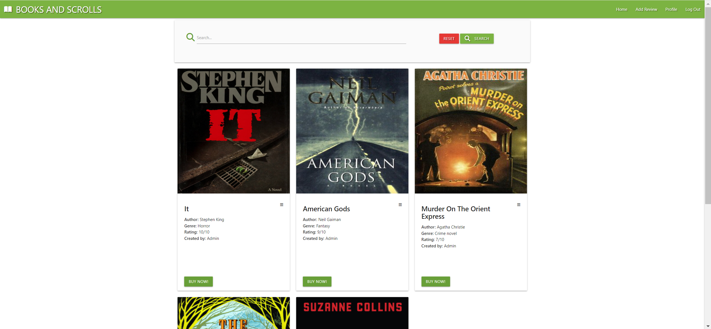
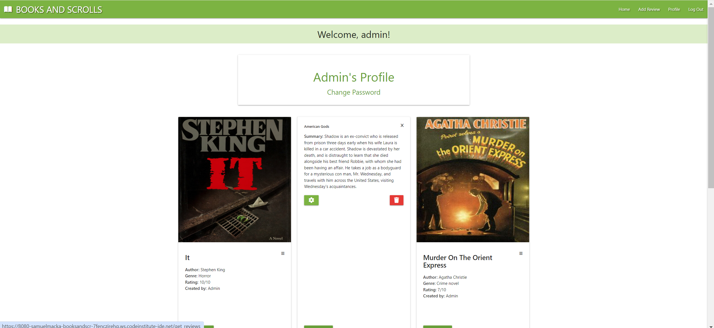

- __Log in/Sign up/Log out/profile__

  - An option to create an account, log in, or log out.
  - A page you can view your logged in profile information, all your reviews as well as edit your password. 

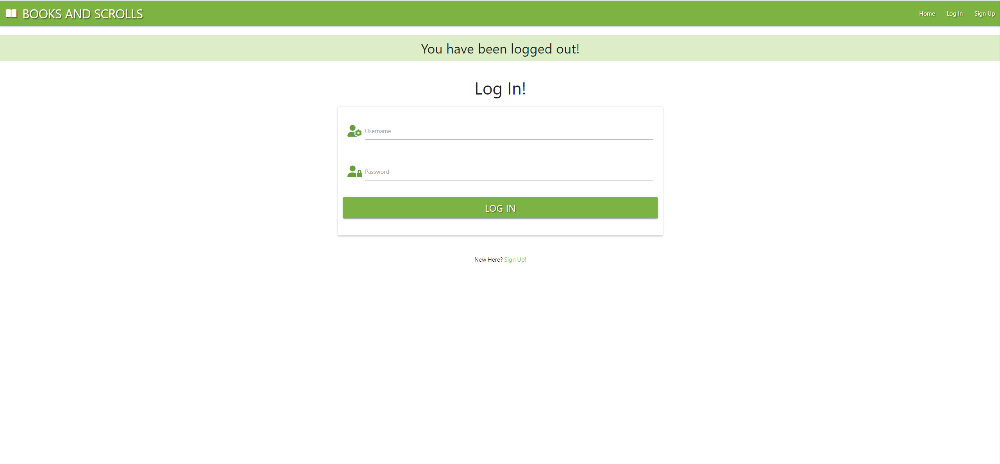

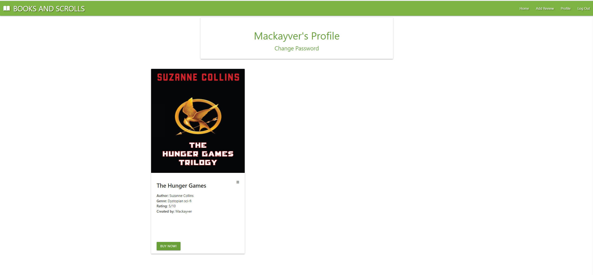

- __Add reviews__

  - A form that gives you all the necessary information to fill out, to make an effective review.
  - an affiliate link to a place to purchase the book directly from the review.

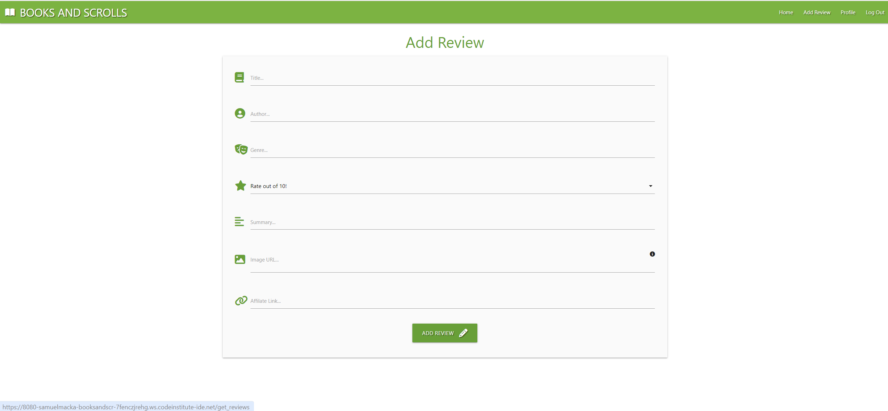


- __Edit reviews__
  - An edit and delete button that will only show up to the admin or the creator of that content.
  - Links to a form that auto completes with the info of the review selected.

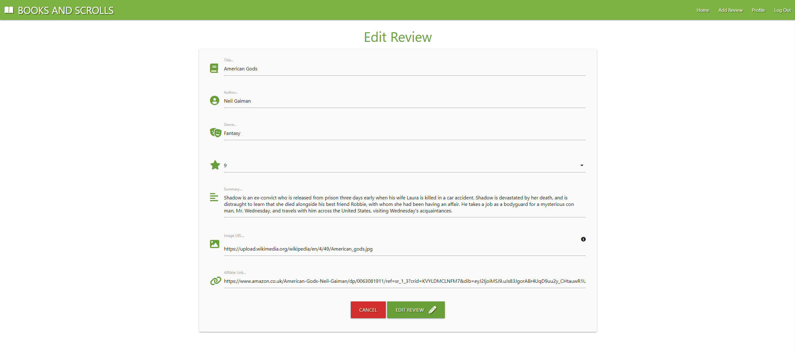


- __Change Password__
  - A link in the profile page to change the current users password.

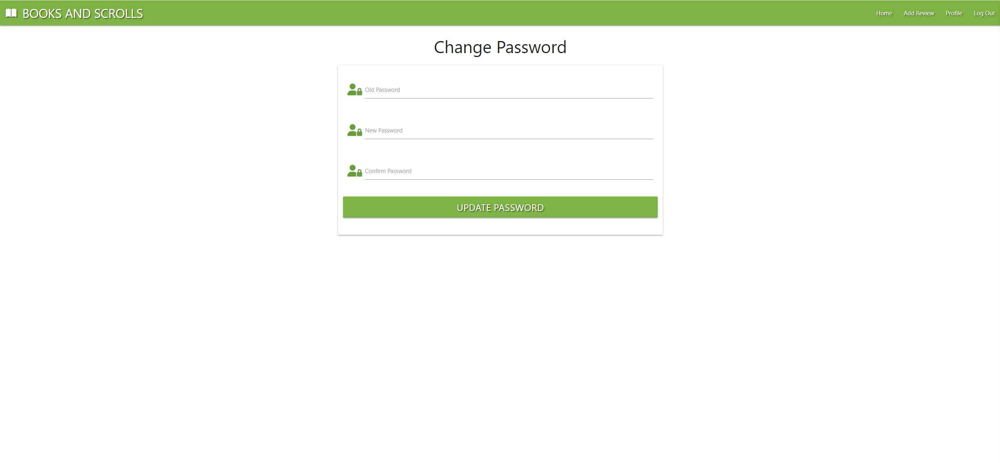


### Features Left to Implement

- a way to rate reviews
- have comment board/forum


## Testing

This is a sample of shots of what the site looks like on different devices. 

#### Desktop
|Firefox 120.0.1|Chrome 120.0.6099.225|
| ------------- | ------------------ |
|||
|||
|||
|||
|||
|||
|||


#### Mobile

##### Safari iOS Phone 17.2


### Validator Testing
- HTML
    - home.html: No errors were returned when passing through the official W3C validator<br> 

   - add_review.html: No errors were returned when passing through the official W3C validator<br> 

   - edit_review.html: No errors were returned when passing through the official W3C validator<br> 

   - login.html: No errors were returned when passing through the official W3C validator<br> 

   - register.html: No errors were returned when passing through the official W3C validator<br> 

   - profile.html: No errors were returned when passing through the official W3C validator<br> 

- CSS 
    - style.css: No errors were returned when passing through offical Jigsaw validator<br> 

- JS 
    - script.js: No errors were returned when passing through offical Jigsaw validator<br> 

    - password_validate.js: No errors were returned when passing through offical Jigsaw validator<br> 

### Manual Testing
- I have tested that this page works in different web browsers.
- I have tested that the project is responsive and works with different device sizes. It looks good and functions as normal. 
- I have tested all links, internal and external. They go to the correct destination and open in the correct way. 
- I have tested that all text and fonts are readable and easy to understand.

### Bugs
#### Bug 1
- My JS to check that both passwords match on the sign up page is breaking my log in page js.
- Moved the code into its own .js file and injected it directly into the sign up page, so the function only loads on register.html

Old code:
```
N/A
```
New code:
add to line 53 in register.html
```
<script src="{{ url_for('static', filename='js/password_validate.js') }}"></script>
```

#### Bug 2 

- The cards for the review lay out get messed up at larger than medium screen size
- Added a set height to the cards

Old code:
```
<div class="col s12 m6 xl4">
```

New code:

```
<div class="col s12 m6 l4">
```
CSS:
```
.card-height {
    height: 800px;
}
```
#### Bug 3 
- If the title, author or author doesnt have any spaces, but is capped out on the word count, the word will stretch out over the card.
- made a new class with a CSS style to truncate long words, and added a tool tip that reveals the whole word when overed over

Old code:
```
<div class="card-content">
                            <span class="card-title activator grey-text text-darken-4">
                                <h4 class="tooltipped" data-position="top" data-tooltip="{{ review.title.title() }}">{{ review.title.title() }}<i class="fas fa-chevron-up right"></i></h4>
                            </span>
                            <p><strong>Author:</strong> {{ review.author.title() }}</p>
                            <p><strong>Genre:</strong> {{ review.genre.capitalize() }}</p>
                            <p><strong>Rating:</strong> {{ review.rating }}/10</p>
                            <p><strong>Created by:</strong> {{ review.user_created.capitalize() }}</p>
                            
                            <br>
                            <a href="{{ review.affiliate_link }}" target="_blank" class="uppercase">Buy Now!</a>
                            
                        </div>
```
New code:

```
<div class="card-content">
                            <span class="card-title activator grey-text text-darken-4">
                                <h4 class="tooltipped truncate" data-position="top" data-tooltip="{{ review.title.title() }}">{{ review.title.title() }}<i class="fas fa-chevron-up right"></i></h4>
                            </span>
                            <p class="truncate"><strong>Author:</strong> {{ review.author.title() }}</p>
                            <p class="truncate"><strong>Genre:</strong> {{ review.genre.capitalize() }}</p>
                            <p><strong>Rating:</strong> {{ review.rating }}/10</p>
                            <p class="truncate"><strong>Created by:</strong> {{ review.user_created.capitalize() }}</p>
                            
                            <br>
                            <a href="{{ review.affiliate_link }}" target="_blank" class="uppercase">Buy Now!</a>
                            
                        </div>
```

```
.truncate {
    white-space: nowrap;
    overflow: hidden;
    text-overflow: ellipsis;
}
```

#### Bug 4
- my delete button is deleting the first review in the line rather than the one you click on.
- the _id needed to be passed through to the modal, so it would find the correct review rather than just the first one on the list.

Old code:
```
<!-- Modal Trigger -->
                                <a href="#deleteReviewModal"
                                    class="btn right red darken-1 modal-trigger"><i class="fas fa-trash"></i></a>
                            
                        </div>
                    </div>
                </div>
        
    </div>

    <!-- Modal Structure -->
    <div id="deleteReviewModal" class="modal">
        <div class="modal-content">
            <h4 class="center">Are you sure?</h4>
            <a href="#" class="modal-close light-green darken-2 btn-large">Cancel</a>
            <a href="#" id="confirm-delete"
                class="red darken-1 btn right">Delete Review</a>
        </div>
    </div>

```
New code:

```
<!-- Modal Trigger -->
                                <a href="#deleteReviewModal"
                                    class="btn right red darken-1 modal-trigger delete-btn" data-review-id="{{ review._id }}"><i class="fas fa-trash"></i></a>
                            
                        </div>
                    </div>
                </div>
        
    </div>

    <!-- Modal Structure -->
    <div id="deleteReviewModal" class="modal">
        <div class="modal-content">
            <h4 class="center">Are you sure?</h4>
            <a href="#" class="modal-close light-green darken-2 btn-large">Cancel</a>
            <a href="#" id="confirm-delete"
                class="red darken-1 btn right">Delete Review</a>
        </div>
    </div>

```

```
$('.delete-btn').click(function(){
        reviewId = $(this).data('review-id');
    });
  $('#confirm-delete').click(function(){
  $('#confirm-delete').attr("href", "/delete_review/" + reviewId)});
  validateMaterializeSelect();
```

#### Bug 5
- my search function blocks stop words, so i cant find books titled things like "it"

Old code:
```

```
New code:

```

```

#### Bug 6
- my flash messages were breaking the layout at smaller screen sizes
- added a max width for the flashes, so it didn't try to put it all on a single line

Old code:
```
<div class="row flashes">
                        <h4 class="light-green lighten-4 center-align">{{ message }}</h4>
                    </div>

```
New code:

```
<div class="row flashes s12">
                        <h4 class="light-green lighten-4 center-align">{{ message }}</h4>
                    </div>

```

### Unfixed Bugs
 - n/a

### User stories Testing
|Story No.|Result|Story/ Evidence|
| ------------- | ------------- | ------------- |
|1|<font color="green"></font> |As the owner of the site, <br> I want people to be able to find books that interest them and have an affiliate link to purchase it <br> So people can find new books to read, and i can earn some money off of the service <br><br> I know I am done when I have book reviews that have relevent links to purchase attachted to them. <br><br> Evidence: <br> |
|2|<font color="green">Test Pass</font> |As a first time user, <br> I want to be able to easily see some book recommendations and reviews <br> So I can start a new series or novel and find a place to buy it <br><br> I know I am done when I have a list of novels/series that are easily viewed and have all the info needed at a quick glance. <br><br> Evidence: <br>  <br> |
|3|<font color="green"></font> |As a repeat user, <br> I want to be able to add my own recommendations for books that I have read and enjoyed <br> So I can introduce as many other people to great books as I can <br><br> I know I am done when I can create and account, add book reviews, and edit my own reviews with an easy to use form that helps me input all the needed information. <br><br> Evidence: <br>  <br>||
|4|<font color="green"></font> |As the owner of the site, <br> I want to have all reviews editable by me or the creater of the review <br> so I can make necessery changes to any reviews, and that no one else can change other peoples reviews <br> <br> I know I am done when only the logged in user or the admin can edit and make changes to the reviews. <br><br> Evidence: <br>  <br>|
|5|<font color="green"></font> |As a current user, <br> To be able to check my profile, which shows me all my reviews, allows me to edit and delete them, as well as edit my password. <br> So I can keep track quickly of all my own reviews, and change my password if my passwords get comprimised. <br> <br> I know I am done when users have a profile page which links to all their own reviews, has all the profile information and has an option to edit password. <br><br> Evidence: <br>  <br> |

### Accessibility Testing

To check the colors and fonts, I used Lighthouse in the Google devtools. The results are shown below:

| Home  |
| ------- |
|  |

| Add review |
| ------- |
|  |

| Edit review | 
| ------- |
|  |

| Profile |
| ------- |
|  |

| Log in |
| ------- |
|  |

| Register |
| ------- |
|  |

| Change Password |
| ------- |
|  |

## Deployment

### Cloning & Forking
#### Fork
1. On GitHub.com, navigate to the [SamuelMacKay/](https://github.com/SamuelMacKay/books-and-scrolls) repository.
2. In the top-right corner of the page, click Fork.
3. By default, forks are named the same as their parent repositories. You can change the name of the fork to distinguish it further.
4. Add a description to your fork.
5. Click Create fork.

#### Clone
1. Above the list of files click the button that says 'Code'.
2. Copy the URL for the repository.
3. Open Terminal. Change the directory to the location where you want the cloned directory.
4. Type git clone, and then paste the URL
5. Press Enter.

### Local Deployment
1. Sign up to [Gitpod](https://gitpod.io/)
2. Download the Gitpod browser extension.
3. On GitHub.com, navigate to the [SamuelMacKay/books-and-scrolls](https://github.com/SamuelMacKay/books-and-scrolls) repository.
4. Above the list of files click the button that says 'Gitpod'.

### Remote Deployment 
 The prgoram was deployed to Heroku. If you have forked/cloned the repository the steps to deploy are:
 1. On Heroku, create a new app.
 2. input a name for your app
 3. Click on the settings tab
 4. Scroll to the Config Vars and click on the "Reveal Config Vars"
 5. Input CREDS into the key field and the content of the Google API creds file into the value area.
 6. Add another config, PORT into key and 8000 into value.
 7. Set the buildbacks to Python and NodeJs in that order .
 8. Link your Heroku app to you repository.
 9. Click on Deploy.
 10. The page will then provide the url to the python terminal.

 The live link can be found here - [Books and Scrolls](https://books-and-scrolls-mackay-6feed6e1aefd.herokuapp.com/)

## Credits
  
### Content
- Processes from the CI task manager mini project was used to help create this website - [Task-Manager-Mini-Project](https://github.com/Code-Institute-Solutions/TaskManagerAuth/tree/main)

- HTML, CSS and Javascript code help was taken from w3schools - [W3Schools](https://www.w3schools.com/)

- Navbar, buttons, cards and form taken from Materialize (https://materializecss.com/)

### Media

#### Icons
- All page Icons - [Font Awesome](https://fontawesome.com/)

- Book cover artwork taken from their wikipedia pages